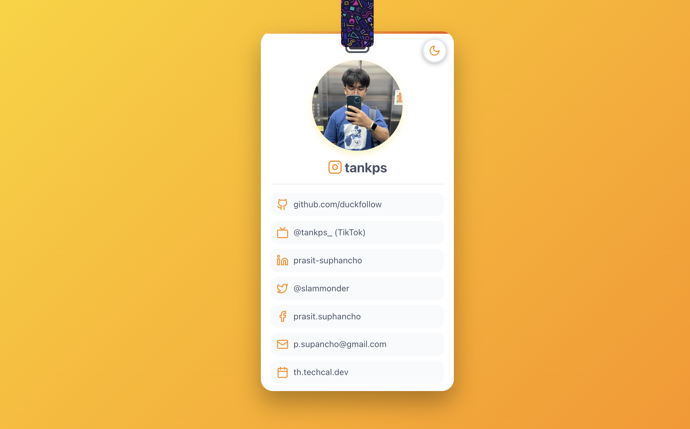

# Pedwork

Pedwork is a modern, stylish personal profile web app built with Next.js and React. It's designed to be your digital identity card—showcasing who you are, your projects, achievements, and unique personality in a confident, visually engaging way.

## Features

- **Profile Card UI**: Inspired by a lanyard name badge, with avatar, name, and contact links.
- **Contact Links**: Supports GitHub, TikTok, LinkedIn, Twitter, Facebook, Email, and more.
- **Dark/Light Mode**: Toggle between dark and light themes, with smooth transitions.
- **Animated Lanyard**: Interactive swing animation on the profile card.
- **Customizable Background**: Colorful geometric SVG pattern for a playful, modern look.
- **Responsive Design**: Looks great on both desktop and mobile.
- **Easy Customization**: Update your avatar, name, and links in the code.

## Demo



## Getting Started

### Prerequisites

- Node.js (v18+ recommended)
- npm

### Installation

```bash
git clone https://github.com/yourusername/pedwork.git
cd pedwork
npm install
```

### Development

```bash
npm run dev
```
Open [http://localhost:3002](http://localhost:3002) in your browser.

### Build for Production

```bash
npm run build
npm start
```

## Customization

- **Profile Info**: Edit `src/app/page.tsx` to change your name, avatar, and contact links.
- **Avatar**: Replace `public/images/avatar.png` with your own image.
- **Background Pattern**: Edit or replace `public/images/background-pattern.svg` for a different look.
- **Meta Tags**: Update `src/app/layout.tsx` for SEO and social sharing.

## Tech Stack

- [Next.js](https://nextjs.org/)
- [React](https://react.dev/)
- [lucide-react](https://lucide.dev/) (icon set)
- CSS Modules

## License

MIT
